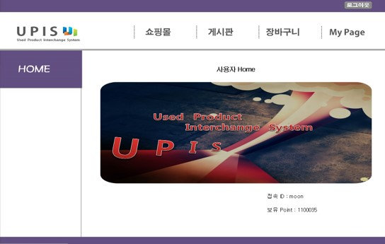
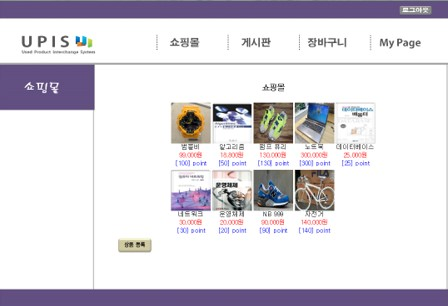
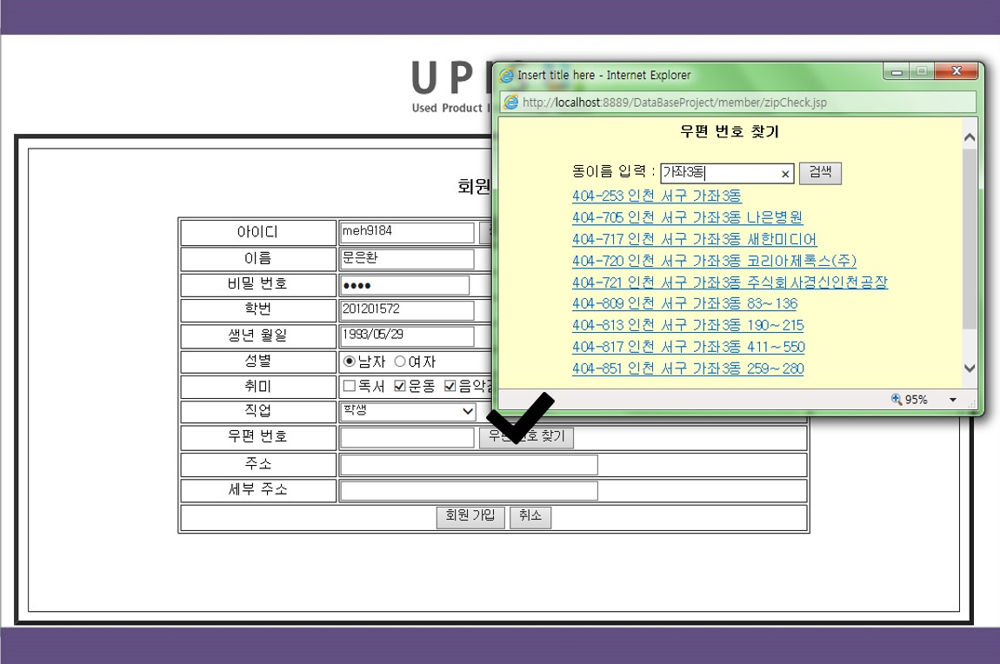
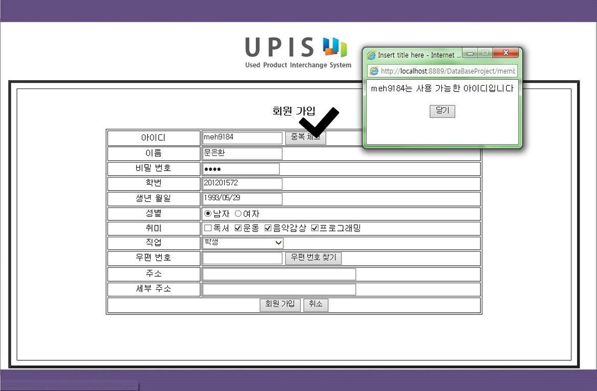
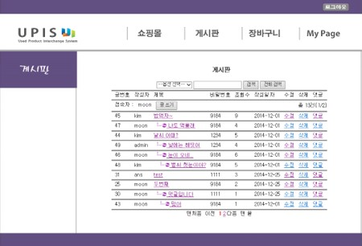
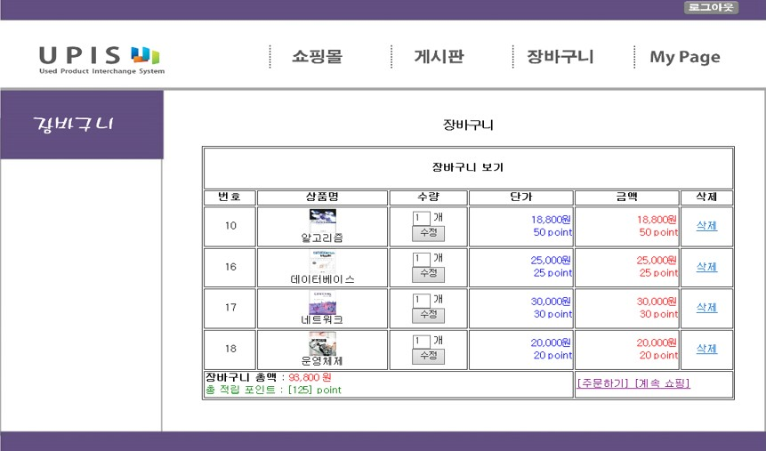
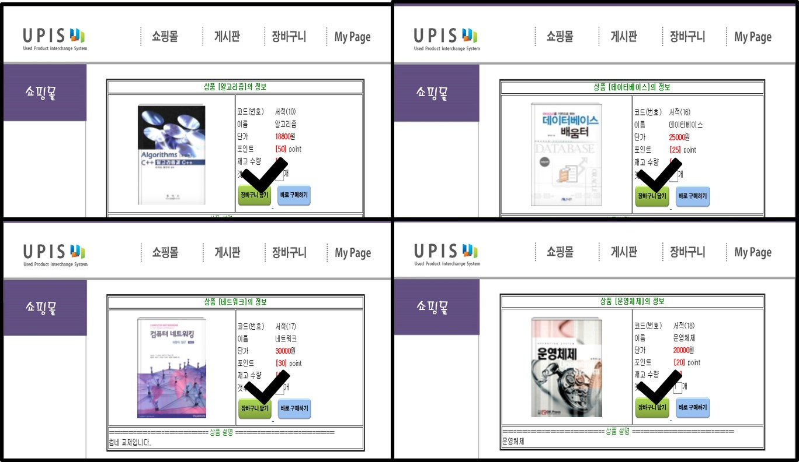

# jsp-upis-site
JSP를 사용하여 만든 중고상품 거래 사이트 UPIS (Used Products Interchange Site)
   

## 메인 화면 / 쇼핑몰 화면

  

    
    
  

   

## 회원가입 기능

  

    
    
  

   

## 게시판 화면 / 장바구니 화면

  

    
    
  

   

## 상품 정보 화면

  

    
  
  

   
